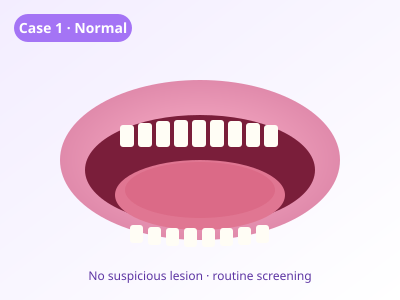
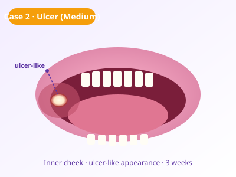
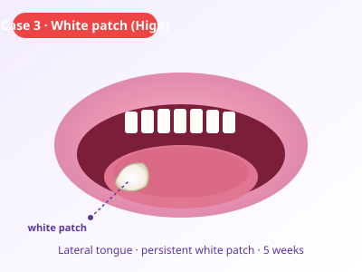
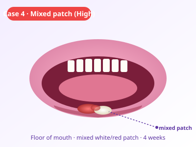

# 🦷 OralScan AI — Agentic AI for Oral Cancer Screening

> **Smart Toothbrush IoT Concept · University Integrated Design Project (IDP)**
>
> A hierarchical multi-agent AI system with **dual dashboards** — a Patient dashboard
> (screening, history, AI chat) and a Clinician console (triage queue, session
> review, analytics) — built on Next.js 16, real-time SSE streaming, multi-LLM
> consensus, RAG grounding, structured-output region detection, and an animated
> agent-flow visualization.

[](https://nextjs.org/)
[](https://www.typescriptlang.org/)
[](https://tailwindcss.com/)
[]()
[]()

> ⚠️ **This prototype is not a medical diagnosis. It is an educational oral cancer screening demonstration. Please consult a qualified dentist or doctor for proper diagnosis.**

---

## 🎯 What it does

Two role-based dashboards driven by **10 specialised agents** behind the scenes:

```
Landing  (/)
├── /patient                  · Patient Dashboard
│   ├── /patient/screening    · run a screening (camera / upload / sample)
│   ├── /patient/history      · risk trend chart over time
│   └── /patient/chat         · AI Health Assistant (Gemini)
│
└── /doctor                   · Clinician Console
    ├── /doctor               · triage queue (sorted by urgency)
    ├── /doctor/session/[id]  · session review + clinical decision form
    └── /doctor/analytics     · cohort stats + AI/clinician agreement rate
```

When the patient provides an oral-cavity image (camera capture, upload, or sample) and fills in a short risk questionnaire, the **Orchestrator Agent** dispatches the sub-agents in sequence and produces:

- A simulated smart-toothbrush telemetry report (image quality, coverage, session validity)
- A vision screening result (visual finding, suspected region, oral-cancer-like probability)
- A 0–100 cancer risk score with categorical band (Low / Medium / High)
- A calm, plain-language patient report
- A structured clinician referral packet **only if** risk is High
- A timestamped audit log of every agent invocation

All wrapped in an animated, network-graph **live pipeline overlay** that shows each agent activating one by one with glowing data-flow dots and a real-time elapsed timer.

---

## 🖼️ Sample cases

The app ships with 4 deterministic demo cases. Click one and the full pipeline runs without an API call.

| Case 1 — Normal | Case 2 — Persistent Ulcer | Case 3 — White Patch | Case 4 — Mixed Patch |
|:---:|:---:|:---:|:---:|
|  |  |  |  |
| 🟢 Low risk | 🟡 Medium risk | 🔴 High risk | 🔴 High risk |

---

## 🧠 System architecture

A **hierarchical multi-agent** design. The Orchestrator is the only agent that knows the whole pipeline; every other agent has a narrow, typed contract.

```
       ┌─────────────────────────────────────────────────────────┐
       │  User                                                   │
       │   • picks a sample case OR uploads an oral cavity photo │
       │   • fills the risk questionnaire                        │
       │   • picks a vision provider (mock / gemini / claude)    │
       └────────────────────────────┬────────────────────────────┘
                                    │
                                    ▼
                   ┌────────────────────────────────┐
                   │     Orchestrator Agent         │
                   │  • creates session id          │
                   │  • drives pipeline             │
                   │  • writes audit log            │
                   └─┬──────┬────────┬─────────┬────┘
                     │      │        │         │
        ┌────────────▼─┐ ┌──▼─────┐ ┌▼───────┐ ┌▼──────────────────┐
        │ Toothbrush   │ │ Vision │ │ Cancer │ │ Patient           │
        │ IoT Agent    │ │ Screen.│ │ Risk   │ │ Communication     │
        │ (telemetry)  │ │ Agent  │ │ Scoring│ │ Agent             │
        └──────────────┘ └────────┘ └────────┘ └─────────┬─────────┘
                                                          │
                                       ┌──────────────────▼──────────────────┐
                                       │  Clinician Referral Agent           │
                                       │  (only when risk level is High)     │
                                       └─────────────────────────────────────┘
```

### Agent responsibilities

| # | Agent | Responsibility |
|---|-------|---------------|
| 1 | **🧠 Orchestrator** | Owns the workflow, creates session id, calls every other agent, writes audit log |
| 2 | **🪥 Toothbrush IoT** | Simulates brushing duration, pressure, motion blur, image quality, coverage, session validity, rescan recommendation |
| 3 | **👁️ Vision Screening** | Calls one of four pluggable vision providers; falls back to mock automatically on failure. Returns structured JSON + bounding boxes |
| 4 | **🤝 Consensus** *(new)* | Runs a second provider in parallel and scores agreement across finding / probability bucket / region |
| 5 | **📊 Cancer Risk Scoring** | Combines vision + questionnaire + telemetry quality into a 0–100 score with transparent driver list |
| 6 | **📚 Retrieval (RAG)** *(new)* | Grounds the result with top-K passages from an oral-cancer knowledge base |
| 7 | **💬 Patient Communication** | Translates the technical result into plain-language patient advice — never says "confirmed cancer" |
| 8 | **🩺 Clinician Referral** | Builds a structured referral packet for a dentist or oral medicine specialist (High-risk only) |
| 9 | **🚦 Triage Prioritization** *(new)* | Computes urgency 0–100 + recommended SLA hours; drives the doctor queue ordering |
| 10 | **🗣️ Chat Agent** *(new)* | Patient-facing conversational assistant; uses Gemini if configured, else safe fallback |

---

## 📚 Risk-scoring weights — literature sources

The 0–100 oral cancer risk score is **not arbitrary**. Every weight in
[`lib/agents/cancerRiskScoringAgent.ts`](lib/agents/cancerRiskScoringAgent.ts)
is calibrated from established oral-cancer epidemiology, with the source cited
inline in code comments and in the patient/clinician UI.

| Factor | Prototype weight | Calibrated against |
|---|---:|---|
| Betel quid / areca nut | **+25** | IARC Monograph Vol 85 (2004) — Group 1 carcinogen, pooled OR ≈ 7–20× |
| Tobacco use | **+18** | IARC Monograph Vol 100E (2012) — OR ≈ 3–5× |
| Alcohol use | **+12** | IARC Monograph Vol 100E (2012) — OR ≈ 2–3× |
| **Tobacco × alcohol synergy** | **+8** | INHANCE consortium (Hashibe 2007, 2009) — supra-additive, combined OR up to ≈ 35× |
| **Tobacco × betel synergy** | **+10** | IARC Monograph Vol 85 (2004) |
| Family history of oral cancer | +10 | Petti S (2003) pooled analysis — OR ≈ 2× |
| Lesion present 2–4 weeks | **+12** | NCCN Head & Neck Guidelines — referral threshold |
| Lesion present > 4 weeks | **+18** | NCCN — stronger clinical red flag |
| Bleeding reported | +12 | NCCN — clinical red flag |
| Ulcer present | +8 | duration already weighted; avoid double-counting |
| Pain reported | +5 | variable, late sign |
| Age ≥ 45 | +5 | Warnakulasuriya 2009 — risk doubles per decade |
| Age ≥ 55 | +10 | Warnakulasuriya 2009 |
| Age ≥ 65 | +14 | Warnakulasuriya 2009 |
| Visual: leukoplakia (white) | +20 | Transformation ≈ 3–17 % (Reichart 2005; Speight 2007) |
| Visual: erythroplakia (red) | +32 | Transformation ≈ 14–50 % (van der Waal 2014) |
| Visual: mixed red-white | +38 | Highest transformation rate among OPMDs (van der Waal 2014) |
| Vision probability ≥ 0.70 | +25 | Model-side contribution |
| Vision probability 0.50–0.69 | +15 | Model-side contribution |
| Vision probability 0.30–0.49 | +8 | Model-side contribution |

Image-quality safeguard: if the image is **poor**, the final score is capped at 55 — the
pipeline can never produce a confident "High" verdict from a blurry frame.

Risk bands: **0–29 Low · 30–59 Medium · 60–100 High**.

> ⚠️ **All weights and odds-ratio ranges above are stated for an *educational
> prototype*. They are not clinical risk equations. The system always returns
> the mandatory medical disclaimer with every result.**

## 🚀 Latest-trend tech in this prototype

| Tech | Where it's used |
|---|---|
| **Next.js 16 App Router** | Multi-route dashboards under `app/patient/*` and `app/doctor/*` |
| **Server-Sent Events (SSE)** | `app/api/screening/stream/route.ts` — agents stream `agent_started` / `agent_completed` events live |
| **Gemini structured outputs** (`responseSchema`) | Hard-typed JSON return from the Vision agent including bounding boxes for the heatmap |
| **Multi-LLM consensus voting** | Run two providers in parallel; compute finding+probability+region agreement |
| **RAG (retrieval-augmented generation)** | Naive keyword retriever over a curated KB — easy to swap for embeddings later |
| **`getUserMedia` camera capture** | In-browser oral-cavity capture with framing guide, no upload step |
| **Region heatmap overlay** | Translucent glowing rectangles drawn over the image at normalized coords |
| **Local-first persistence** | All sessions stored in `localStorage`; cross-tab sync via store subscription |
| **`useTransition`-friendly UI** | Hooks-driven session store with pub-sub for instant cross-page updates |
| **Pure SVG charts** | Risk-trend line chart with zero charting-library dependency |
| **Force-loaded `.env.local`** | `lib/utils/loadEnvLocal.ts` overrides any expired OS env var |

## 🔌 Vision providers (pluggable)

Pick at run-time in the UI. If credentials are missing or the call fails, the app **falls back to mock automatically** and records the reason in the audit log — it never crashes.

| Provider | Cost | Internet | Best for |
|----------|------|----------|----------|
| `mock` | Free | ❌ | IDP demo — fastest, deterministic per upload |
| `gemini` | Free tier on AI Studio | ✅ | Real Vision API showcase |
| `claude` | Paid (Anthropic) | ✅ | Higher-quality reasoning |
| `local` | Free (your own GPU) | ❌ | Final phase — custom-trained model |

---

## 🚀 Quick start

### Prerequisites
- **Node.js 18+** (this project was scaffolded on Node 24)
- **npm** (ships with Node)

### 1. Clone & install

```bash
git clone https://github.com/TKY0527/um-idp-oral-cancer-agentic-ai.git
cd um-idp-oral-cancer-agentic-ai
npm install
```

### 2. Run in mock mode (no key needed)

```bash
npm run dev
```

Open <http://localhost:3000> → pick a sample case → click **▶ Run Agentic AI Screening**. Watch the animated pipeline overlay.

### 3. Run with Gemini Vision

1. Get a free key at <https://aistudio.google.com/apikey>
2. Copy `.env.example` → `.env.local`:
   ```env
   GEMINI_API_KEY=YOUR_KEY_HERE
   GEMINI_MODEL=gemini-2.5-flash
   ```
3. `npm run dev`, then in the UI pick **Gemini Vision** under Step 3 and **upload a real photo** (sample cases use a fixed preset by design — only uploads hit the live API).

### 4. Run with Claude Vision

1. Get a key at <https://console.anthropic.com>
2. In `.env.local`:
   ```env
   ANTHROPIC_API_KEY=YOUR_KEY_HERE
   CLAUDE_MODEL=claude-sonnet-4-5
   ```
3. `npm run dev`, pick **Claude Vision** in the UI.

---

## 🎬 The animated agent flow

When you click **Run Agentic AI Screening**, a full-screen modal opens showing:

- The **Orchestrator hub** at the centre with a pulsing glow and dashed spinning ring
- **5 sub-agents** in a pentagon around it
- **Glowing dots** travelling along each spoke when that agent activates (data flow visualisation)
- **Typewriter previews** of each agent's actual output
- **Live elapsed timer** per agent with sub-second precision
- **Skip animation →** button (or press `ESC`)

The total animation is paced over ~7 seconds while the API call runs in parallel. When both finish, the modal closes and the full results render below.

---

## 🛡️ Why this is *screening support*, not a diagnosis

The system is intentionally cautious:

- The Vision agent is prompted to **never claim certainty**
- Poor image quality **caps the risk score at 55** — no "High" verdict from a blurry frame
- Every result is wrapped with the **mandatory medical disclaimer**
- The Patient Communication agent uses calm language and **never says "confirmed cancer"**
- All four sample-case images are SVG illustrations, not real patient data

---

## 📁 Folder structure

```
.
├── app/
│   ├── api/screening/route.ts    # POST endpoint that drives the pipeline
│   ├── globals.css
│   ├── layout.tsx
│   └── page.tsx                  # Main dashboard UI
├── components/                   # 15 React components
│   ├── AgentFlowOverlay.tsx      # The animated network-graph overlay
│   ├── AgentPipeline.tsx
│   ├── ArchitectureExplainer.tsx
│   ├── AuditLogPanel.tsx
│   ├── ClinicianReferralCard.tsx
│   ├── HeroSection.tsx
│   ├── ImageUpload.tsx
│   ├── PatientReportCard.tsx
│   ├── ProviderStatusBadge.tsx
│   ├── QuestionnaireForm.tsx
│   ├── RiskScoreCard.tsx
│   ├── SafetyBanner.tsx
│   ├── SampleCaseSelector.tsx
│   ├── ToothbrushTelemetryCard.tsx
│   └── VisionResultCard.tsx
├── lib/
│   ├── agents/                   # 6 agents
│   │   ├── orchestratorAgent.ts
│   │   ├── toothbrushIoTAgent.ts
│   │   ├── visionScreeningAgent.ts
│   │   ├── cancerRiskScoringAgent.ts
│   │   ├── patientCommunicationAgent.ts
│   │   └── clinicianReferralAgent.ts
│   ├── visionProviders/          # 4 pluggable providers
│   │   ├── mockVisionProvider.ts
│   │   ├── geminiVisionProvider.ts
│   │   ├── claudeVisionProvider.ts
│   │   └── localModelProvider.ts
│   ├── data/sampleCases.ts       # 4 built-in demo cases
│   ├── types/screening.ts        # Shared TypeScript contracts
│   └── utils/
│       ├── riskUtils.ts
│       └── loadEnvLocal.ts       # Force-loads .env.local over OS env vars
├── public/samples/               # 4 SVG illustrations
├── training/                     # Planning for the future custom model
│   ├── README.md
│   ├── dataset_structure.md
│   ├── future_train_model.py
│   └── future_fastapi_model_server.py
├── .env.example
├── .gitignore
├── next.config.ts
├── package.json
├── postcss.config.mjs
├── tailwind.config.ts
└── tsconfig.json
```

---

## 🔮 Future: replacing the Vision API with a custom-trained model

The Vision Screening Agent is designed for one-config-line provider swaps. The next phase of the project is to:

1. Collect a labelled oral-cavity dataset (clinical partnership)
2. Transfer-learn a small CNN backbone (MobileNetV3-Small or EfficientNet-B0)
3. Calibrate probabilities (temperature scaling)
4. Export ONNX and serve with FastAPI
5. Set `VISION_PROVIDER=local` and `LOCAL_MODEL_ENDPOINT=http://localhost:8000/predict`

Detailed plan and skeletons in [`training/`](training/):
- [`training/README.md`](training/README.md) — full roadmap
- [`training/dataset_structure.md`](training/dataset_structure.md) — expected layout
- [`training/future_train_model.py`](training/future_train_model.py) — training skeleton
- [`training/future_fastapi_model_server.py`](training/future_fastapi_model_server.py) — serving skeleton

The dataset itself is **never committed to GitHub** — `.gitignore` excludes `data/`, `models/`, `*.pth`, `*.pt`, `*.onnx`.

---

## 🛠️ Commands

```bash
npm install         # one-time
npm run dev         # local development server (http://localhost:3000)
npm run build       # production build
npm run start       # serve the production build
npm run typecheck   # TypeScript-only check (no emit)
```

---

## 🧬 Tech stack

- **Next.js 16** (App Router, Turbopack)
- **React 19**
- **TypeScript 5** (strict)
- **Tailwind CSS 3** (light-purple theme)
- **Zero database** · **Zero auth** · **Zero patient data**
- Pure server-side agent pipeline behind a single Next.js API route

---

## 👤 Author

**TKY0527** — University Integrated Design Project (Part 2)

---

## 📜 License & disclaimer

University IDP prototype. **Educational use only — not a medical device.**

This software has not been clinically validated, does not store patient data, and must never be used to make health decisions. The Vision Screening Agent is explicitly prompted to never claim certainty, the Risk Scoring Agent caps the score at 55 when image quality is poor, the Patient Communication Agent never says "confirmed cancer", and every result is wrapped with the mandatory disclaimer above.
